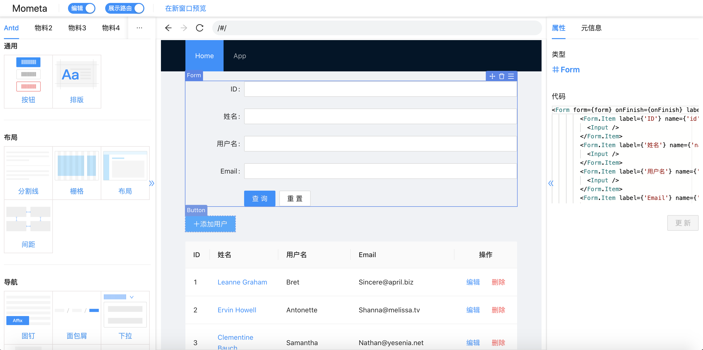
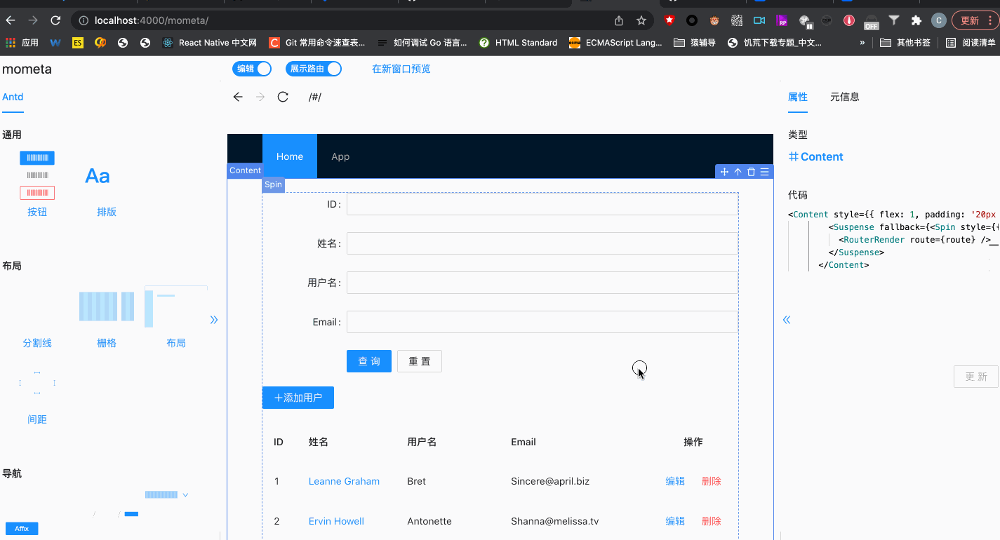
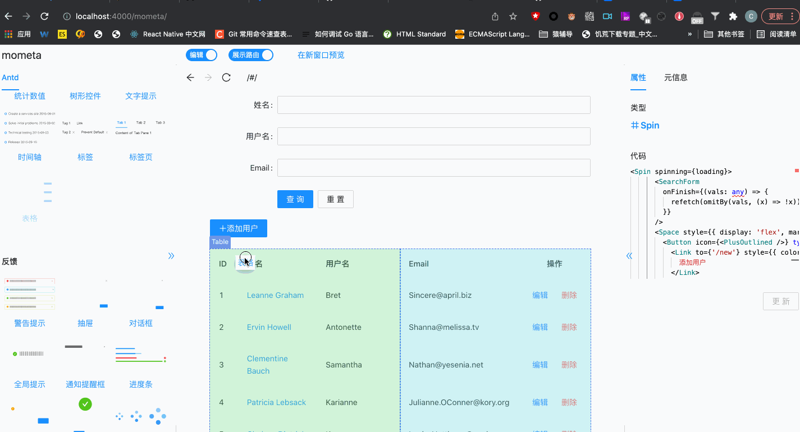
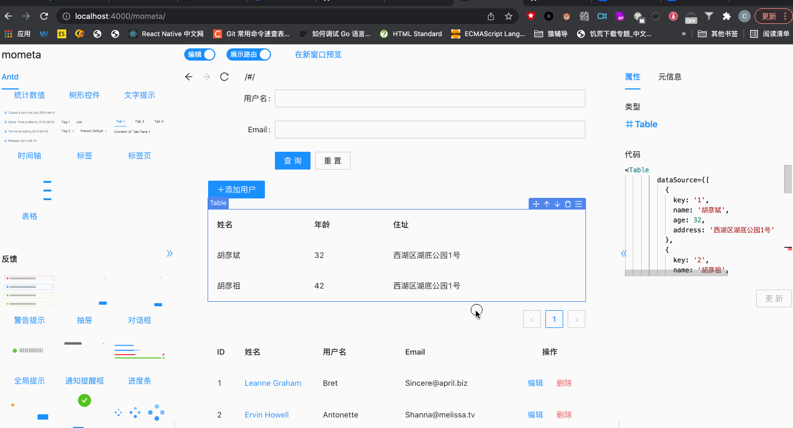
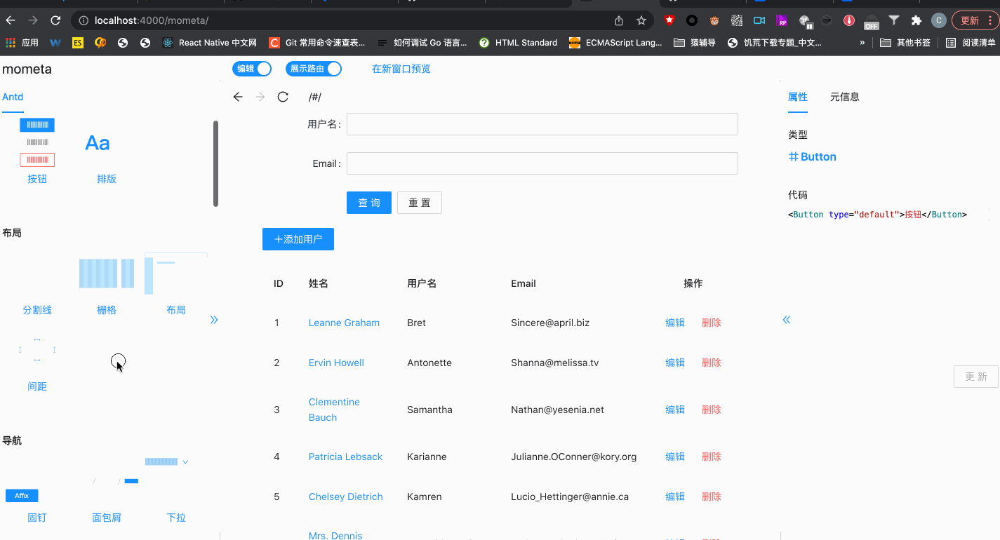
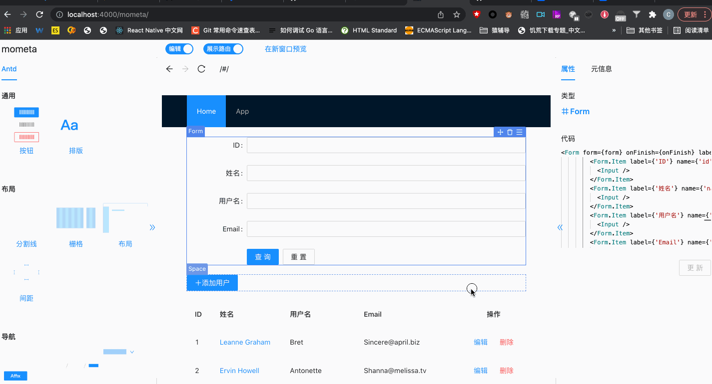
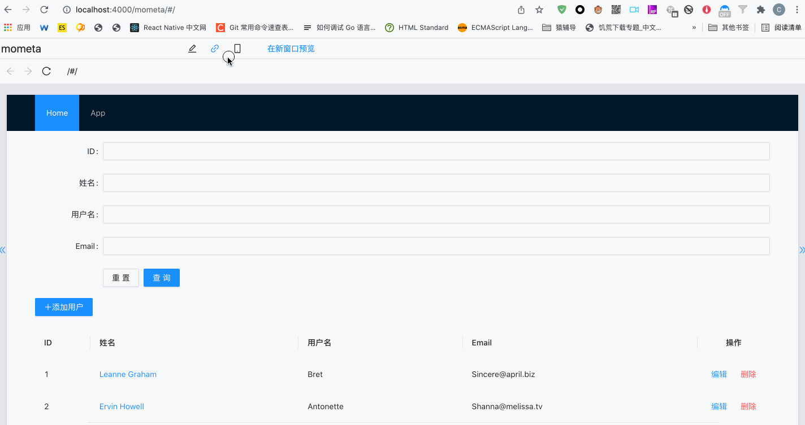
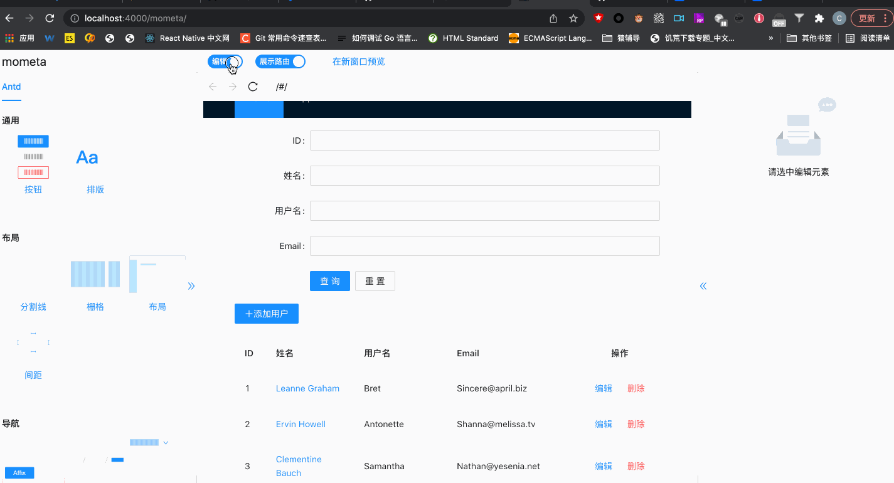

<p align="center">
  
</p>
<p align="center">
  <a href="https://github.com/imcuttle/mometa/actions"></a>
  <a href="https://codecov.io/github/imcuttle/mometa?branch=master"></a>
  <a href="https://prettier.io/"></a>
  <a href="https://conventionalcommits.org"></a>
</p>

<p align="center">
The tool for R&D which has low-code meta programming and WYSIWYG editing
</p>

<p align="center">
English | <a href="README_zh_CN.md">简体中文</a>
</p>

---

<!-- toc -->

- [Why use it?](#why-use-it)
- [Features](#features)
- [scenes to be used](#scenes-to-be-used)
  - [Develop a new page](#develop-a-new-page)
  - [There are existing historical projects and the iteration function is needed, only in a small ui module.](#there-are-existing-historical-projects-and-the-iteration-function-is-needed-only-in-a-small-ui-module)
- [Operation demonstration](#operation-demonstration)
  - [edit](#edit)
    - [Reverse positioning](#reverse-positioning)
    - [Insert material](#insert-material)
    - [Delete view](#delete-view)
    - [Mobile view](#mobile-view)
    - [Edit code](#edit-code)
  - [Preview](#preview)
    - [Material Preview](#material-preview)
    - [Responsive layout](#responsive-layout)
    - [Route simulation](#route-simulation)
- [How to implement](#how-to-implement)
- [Quick start](#quick-start)
- [how to use](#how-to-use)
  - [Install dependencies](#install-dependencies)
  - [Use antd material](#use-antd-material)
  - [Access editor](#access-editor)
- [NPM Packages](#npm-packages)
- [Author](#author)

<!-- tocstop -->

## Why use it?

mometa is not similar to the traditional lowcode project which is schema based. mometa is code based, It's WYSIWYG editing following code ast.

**Which problems mometa can resolved：**

- There is no dependence on low-code platforms, and secondary development can seamlessly enter code development mode.
- It also supports WYSIWYG visual editing to improve efficiency and development experience.
- Provide material ecology, customize materials, improve material use experience, and increase reuse rate.

The positioning of mometa is more based on the local development model of programmers, adding the ability of visual coding (the local code file itself is also modified);\
**It is not recommended to set up a local development environment for remote services, so there is no online deployment.**\
The current implementation relies on the webpack dev development mode, and compatibility with vite will be considered in the future.

<p align="center">
  
</p>

## Features

- 🛠 Code visual editing for R\&D, directly acting on source code
  - Responsive layout, routing simulation, material preview
  - Reverse locating (locating source code)
  - Drag and drop to insert materials
  - Drag and move
  - Moving up and down
  - Deleting
  - Replacing
  - Layers Selecting
- 🍒 Open material ecology, customizable material library within the team, see [mometa-mat](https://github.com/imcuttle/mometa-mat)
- 💎 Multi-language, multi-ecological support, currently only supports React, there are plans to support Vue in the future
- 🔥 Access-friendly, Webpack>=4 plug-in access
- 🌟 Development friendly, the material library supports hot updates without destroying the existing development model

## scenes to be used

#### Develop a new page

1.  Use team development instructions to add an empty placeholder route & page
2.  Enter mometa, view local materials and remote material markets, select the materials you need, drag and drop directly, and the basic page layout is completed.
3.  Enter the IDE, complete data joint debugging, data transfer, etc., and source code development

#### There are existing historical projects and the iteration function is needed, only in a small ui module.

1.  Enter mometa and insert material operation
2.  Reverse positioning to directly enter IDE source code development

## Operation demonstration

#### edit

##### Reverse positioning

Support positioning code location from view


##### Insert material

Visually insert materials


##### Delete view



##### Mobile view



##### Edit code



#### Preview

##### Material Preview


##### Responsive layout



##### Route simulation



## How to implement

See [mometa implementation principle](./docs/how-to-work.md)

## Quick start

Since mometa relies on the local development environment and is only used in the local development environment, there is no online demo built; it can be used during local development.

```bash
git clone https://github.com/imcuttle/mometa.git
cd mometa
pnpm install
pnpm run start:app:cr # 开启本地开发预览模式
```

## how to use

#### Install dependencies

```bash
npm i @mometa/editor -D
```

#### Use antd material

1.  Install antd materials

```bash
npm i @mometa-mat/antd -D
```

2.  Create `mometa-material.config.js` in the project root directory

```jsx
module.exports = [require('@mometa-mat/antd').default]
```

You can also create your own material library. For data structure rules, see [Material definition](./packages/materials-generator/src/types.ts)

#### Access editor

`webpack.config.js` is modified as follows:

```js
const MometaEditorPlugin = require('@mometa/editor/webpack')

module.exports = {
  module: {
    rules: [
      {
        test: /\.(js|mjs|jsx|ts|tsx)$/,
        // Note that only the file directory you need to edit needs to be processed
        include: paths.appSrc,
        loader: require.resolve('babel-loader'),
        options: {
          plugins: [isEnvDevelopment && require.resolve('@mometa/editor/babel/plugin-react')]
        }
      }
    ]
  },
  plugins: [
    isEnvDevelopment &&
      new MometaEditorPlugin({
        react: true,
        //Open material preview
        experimentalMaterialsClientRender: true
      })
  ]
}
```

**Note: You do not need to enable the official default react-refresh when using it. Mometa will enable the react-refresh capability by default**

Start webpack dev server and open `http://localhost:${port}/mometa/`

The provided example can be found at [@mometa/app](./packages/app)】

## NPM Packages

- [@mometa/editor](packages/editor) - 编辑器
- [@mometa/fs-handler](packages/fs-handler) - 代码操作转换核心逻辑，如删除、移动、替换、插入等
- [@mometa/materials-generator](packages/materials-generator) - 物料生成 & 解析
- [@mometa/materials-resolver](packages/materials-resolver) - Resolve materials config
- [@mometa/react-refresh-webpack-plugin](packages/react-refresh-webpack-plugin) - An **EXPERIMENTAL** Webpack plugin to enable "Fast Refresh" (also previously known as _Hot Reloading_) for React components.

## Author

This library is written and maintained by imcuttle, <a href="mailto:imcuttle@163.com">imcuttle@163.com</a>.
