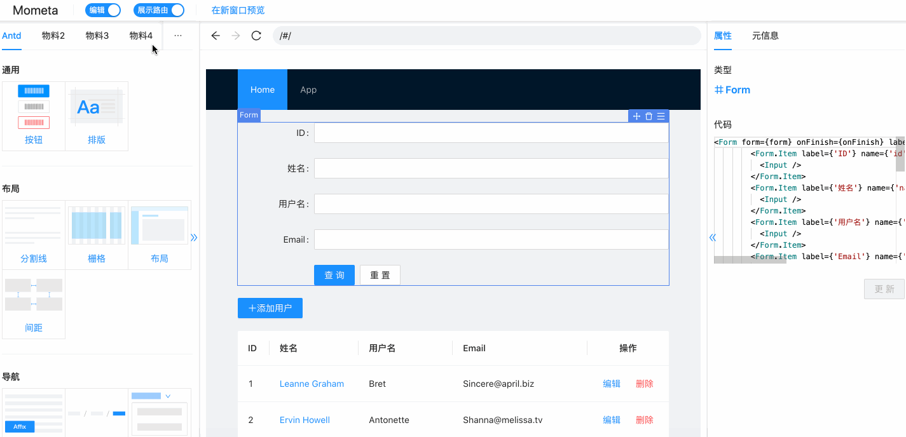
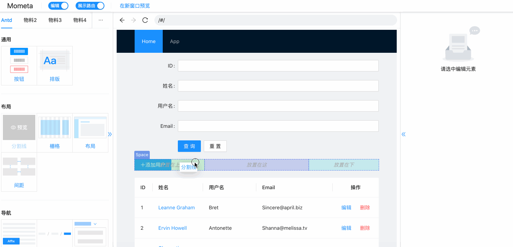

<p align="center">
  
</p>
<p align="center">
  <!--<a href="https://travis-ci.org/imcuttle/mometa"></a>-->
  <!--<a href="https://codecov.io/github/imcuttle/mometa?branch=master"></a>-->
  <a href="https://prettier.io/"></a>
  <a href="https://lernajs.io/"></a>
  <a href="https://conventionalcommits.org"></a>
</p>
<p align="center">面向研发的低代码元编程（代码可视化）能力</p>

## 背景

mometa 不是传统主流的低代码平台（如 amis/云凤蝶），mometa 是面向研发的、代码可视设计编辑平台；它更像是 dreamweaver、gui 可视编辑 之于 程序员。

**它用于解决的问题有：**

- 对低代码平台不形成依赖，二次开发可以无缝进入代码开发模式
- 同时支持所见即所得的可视编辑，用于提效，提升开发体验
- 提供物料生态，可自定义物料，提升物料使用体验，提升复用率

<p align="center">
  
</p>

## 特性

- 面向研发的代码可视化编辑，直接作用于源码
  - 反向定位（视图定位源码）
  - 拖拽插入物料
  - 拖拽移动
  - 上下移动
  - 删除
  - 替换
  - 层级选择
- 开放物料生态，可定制团队内物料库，见 [mometa-mat](https://github.com/imcuttle/mometa-mat)
- 多语言、多生态支持，目前暂只支持 React
- 接入友好，Webpack 0 成本接入
- 开发友好，物料库支持热更新，不破坏已有开发模式

## 使用场景

#### 新开发一个页面

1.  使用团队开发指令，新增一个空的占位路由 & 页面
2.  进入 mometa，查看本地物料，和远端物料市场，选中自己需要的物料，直接拖拽，基本成型的页面布局完成
3.  进入 ide，完成数据联调，数据传递等，源码开发

#### 已有历史项目，需要迭代功能，只在某一小块 ui 模块内

1.  进入 mometa，物料操作插入
2.  反向定位直接进入 ide 源码开发

## 操作演示

#### 预览

<p align="center">
  
</p>

#### 编辑

<p align="center">
  
</p>

## 如何使用

#### 安装依赖

```bash
npm i @mometa/materials-generator @mometa/editor -D
```

#### 使用 antd 物料

1.  安装 antd 物料

```bash
npm i @mometa-mat/antd -D
```

2.  在项目根目录中创建 `mometa-material.config.js`

```jsx
const { resolveLibMatConfig } = require('@mometa/materials-generator')

module.exports = [resolveLibMatConfig('antd')]
```

你也可以创建自己的物料库，数据结构规则见 [Material 定义](./packages/materials-generator/src/types.ts)

#### 接入编辑器

`webpack.config.js` 修改如下：

```js
const MometaEditorPlugin = require('@mometa/editor/webpack')

module.exports = {
  module: {
    rules: [
      {
        test: /\.(js|mjs|jsx|ts|tsx)$/,
        // 注意，只需要处理你需要编辑的文件目录
        include: paths.appSrc,
        loader: require.resolve('babel-loader'),
        options: {
          plugins: [isEnvDevelopment && require.resolve('@mometa/editor/babel/plugin-react-runtime')]
        }
      }
    ]
  },
  plugins: [isEnvDevelopment && new MometaEditorPlugin()]
}
```

**注意：使用时，不需要开启官方预设的 react-refresh，mometa 默认会开启 react-refresh 能力**

启动 webpack dev server，开启 `http://localhost:${port}/mometa/` 即可

提供的例子可见 [@mometa/app](./packages/app)

## Packages

- [@mometa/editor](packages/editor) - 编辑器
- [@mometa/fs-handler](packages/fs-handler) - 代码操作转换核心逻辑，如删除、移动、替换、插入等
- [@mometa/materials-generator](packages/materials-generator) - 物料生成 & 解析
- [@mometa/react-refresh-webpack-plugin](packages/react-refresh-webpack-plugin) - An **EXPERIMENTAL** Webpack plugin to enable "Fast Refresh" (also previously known as _Hot Reloading_) for React components.

## Contributing

- Fork it!
- Create your new branch:\
  `git checkout -b feature-new` or `git checkout -b fix-which-bug`
- Start your magic work now
- Make sure npm test passes
- Commit your changes:\
  `git commit -am 'feat: some description (close #123)'` or `git commit -am 'fix: some description (fix #123)'`
- Push to the branch: `git push`
- Submit a pull request :)

## Authors

This library is written and maintained by imcuttle, <a href="mailto:imcuttle@163.com">imcuttle@163.com</a>.

## License

MIT - [imcuttle](https://github.com/imcuttle) 🐟
