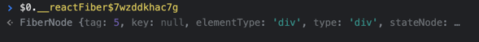
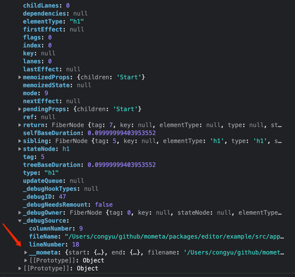

# 实现原理

## React 生态实现

如对于如下 React 应用代码：

```jsx
function App() {
  const [list] = React.useState(['p1', 'p2'])

  return (
    <div>
      <h1>Title</h1>
      {list.map((text, i) => (
        <p key={i}>{text}</p>
      ))}
    </div>
  )
}

ReactDOM.render(<App />, window.root)
```

#### 编译时注入代码元数据

通过 babel 插件 `babel/plugin-react`，编译时注入 JSX 的元信息 `__mometa` 至 props 中，包括 colNumber, lineNumber, filename 等；

```jsx
function App() {
  const [list] = React.useState(['p1', 'p2'])

  return (
    <div
      __mometa={{
        start: { line: 5, column: 4 },
        end: { line: 10, column: 4 },
        filename: '/App.tsx',
        name: 'div',
        text: 'raw text',
        // 以及其他数据
      }}
    >
      <h1 __mometa={{...}}>Title</h1>
      {list.map((text, i) => (
        <p __mometa={{...}} key={i}>{text}</p>
      ))}
    </div>
  )
}
```

完整的元数据类型定义如下：

```typescript
interface RangeLocation {
  // 视图头部的位置
  // $POS<div></div>
  start: {
    line: number
    column: number
  }
  // 视图尾部的位置
  // <div></div>$POS
  end: {
    line: number
    column: number
  }
}

interface MometaData extends RangeLocation {
  // 视图 JSX name
  name: string
  // 视图 JSX 完整 text
  text: string
  // 视图 JSX 文件名
  filename: string
  // 视图 JSX 是否无 children, 如 <div></div>
  // 用来控制可视编辑的时候注入 空元素占位符，以便进行操作
  emptyChildren: boolean
  // 相对于 PWD 的相对文件名
  // 可视化编辑后，用于判断是否命中匹配的改动，resolve loading
  relativeFilename: string
  // 根据 mometa 数据 shasum 生成的唯一 id
  hash: string
  // 是否为某作用域内的第一个元素
  // 如 App 组件中，`div` 和 `p` 为其中的第一个元素，`h1` 不是
  // 用于可视化编辑后，控制是否需要前置包裹 <>$CONTENT</>
  // <p></p> => <><p>inserted</p><p></p></>
  isFirst: boolean
  // 视图 JSX 是否 selfClosed, 如 <div />
  // 用来控制可视编辑的时候是否能够插入到 children 中
  selfClosed: boolean

  // 视图内部头部的位置
  // <div>$POS  </div>
  innerStart: {
    line: number
    column: number
  }
  // 视图内部尾部的位置
  // <div>  $POS</div>
  innerEnd: {
    line: number
    column: number
  }

  /**
   * 视图容器信息，在 React 中为被 `{}` 包裹的 JSXElement
   * {list.map((text, i) => (
   *    <p key={i}>{text}</p>
   * ))}
   * 用于可视化编辑时（如删除、移动、插入），控制的是 container 还是 视图本身
   */
  container?: {
    isFirstElement: boolean
    text: string
    hash: string
  } & RangeLocation

  /**
   * 上个兄弟节点的位置信息，用于控制上移
   */
  previousSibling?: {
    text: string
  } & RangeLocation
  /**
   * 下个兄弟节点的位置信息，用于控制下移
   */
  nextSibling?: {
    text: string
  } & RangeLocation
}
```

根据以上视图代码元数据，可以推导出可视化编辑操作需要在哪个代码位置，执行什么操作；

#### Mometa 服务加载

在非 webpack dev server 端口启动 http 服务，主要做了如下事情：

1. 文件文本操作  
   编辑器内涉及到视图节点的改动，都需要通过该能力直接进行代码改动。具体实现可见 [@mometa/fs-handler](../packages/fs-handler)
2. 打开编辑器  
   反向定位的能力中，通过该接口能力实现，默认会推导本地正在执行的编辑器应用，也可以通过设置 `MOMETA_EDITOR` 环境变量进行覆盖；
   如 `webstorm`
3. 物料热更新  
   有两种热更新模式：服务端序列化数据热更新 或 客户端渲染热更新(开启 `experimentalMaterialsClientRender`)

   **服务端序列化数据热更新**：  
   物料文件的改动监听都在服务端内自己处理，首次或一旦检测到改动，则推送最新数据至浏览器进行更新，实现见 https://github.com/imcuttle/hot-module-require
   返回为可序列化的物料数据。

   **客户端渲染热更新**：  
   物料文件的改动监听交由 webpack，首次或一旦检测到改动，则触发 webpack 构建编译，返回为前端可执行代码；所以使用该方式可以达到物料动态预览的效果

#### 编辑器加载

通过 Webpack 插件机制，通过 `copy-webpack-plugin` 注入编辑器资源 (html/css/js)，并且注入 editorConfig 至 HTML 中

所以默认可以通过 `http://localhost:$PORT/mometa/` 访问编辑器；同时在编辑器中开启应用本身的 `iframe`

由于涉及到编辑器中的物料拖拽至 iframe 中数据通信，所以使用的是同域数据通信方案，即编辑器内可以任意访问 iframe 中的数据及 DOM；

同时为了尽可能的不影响应用本身的 DOM 结构和样式，所以编辑器中的辅助线的 DOM 和样式都在编辑器 DOM 流中进行实现；当开启编辑模式时，应用内事件将会被捕获拦截，并且阻止其冒泡和默认行为，同时通知到编辑器，进行辅助线的绘制

而通过 MutationObserver 监听应用 DOM 节点，实时同步辅助线和 DOM 的关联；

在 React 生态中，HTMLElement 通过 \_\_reactFiberXX 属性，获取对应 fiber 节点，判断是否为 React 渲染元素，同时拿到层级关系 (`fiber.return`)



在开发模式下，也能够通过 fiber 实例中的 `_debugSource` 获取 mometa 数据  


后续进行的一系列编辑器操作，如 删除、移动、插入、替换

都需要通过 Node 端服务进行文件本身的改动，进而触发 Webpack HMR 进行局部更新

#### 应用运行时注入

通过 Webpack 插件机制，额外注入 mometa 运行时 `entry`；

运行时逻辑包括：

- 路由拦截，同步至外部编辑器；
- 热更新共享，让编辑器能够知晓应用本身的更新；
- 样式注入，让编辑器能够控制应用样式，如空元素占位的样式；
- 同时为了不影响正常的渲染，不暴露 `__mometa` props，拦截覆盖 `react/jsx-dev-runtime` 中的 `jsxDEV` 方法，用于隐藏 `__mometa`

```jsx
const jsxDEV = JSXDEVRuntime.jsxDEV
JSXDEVRuntime.jsxDEV = function _jsxDev() {
  let [type, props, key, isStaticChildren, source, ...rest] = arguments
  if (props?.__mometa) {
    const __mometa = props?.__mometa
    delete props?.__mometa
    source = {
      ...source,
      __mometa
    }
  }
  return jsxDEV.apply(this, [type, props, key, isStaticChildren, source, ...rest])
}
```
